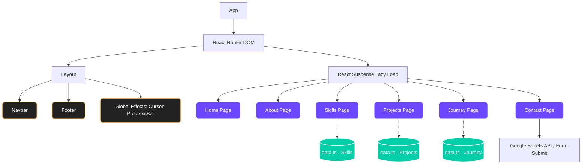

# 🌌 Premium Interactive 3D Developer Portfolio

<div align="center">
  
  
  
  
</div>

<br/>

Welcome to my interactive **3D Developer Portfolio**! This is a modern, high-performance web experience built with **React, TypeScript, Vite, and Framer Motion** to showcase my software development skills, data analytics achievements, and technical credentials.

---

## 🔗 Live Links & Profiles

- 🌍 **Portfolio**: [umangpandey.vercel.app](https://umangpandey.vercel.app/)
- 💻 **GitHub Repository**: [github.com/Umangpandey75](https://github.com/Umangpandey75)
- 👔 **LinkedIn Profile**: [linkedin.com/in/umang-pandey-01b486273](https://www.linkedin.com/in/umang-pandey-01b486273)
- 📧 **Contact Email**: `umangpandey.co@gmail.com`

---

## 🏗️ Project Architecture & Flow Graph



---

## 📁 Project Structure

```text
portfolio-main/
├── src/
│   ├── components/
│   │   ├── layout/
│   │   │   ├── Navbar.tsx      # Navigation with mobile menu
│   │   │   └── Footer.tsx      # Global footer component
│   │   └── GlobalEffects.tsx   # Custom cursor & scroll progress
│   ├── context/
│   │   └── ThemeContext.tsx    # Light/Dark mode state management
│   ├── pages/                  # Modular Page Components
│   │   ├── Home/
│   │   │   └── Home.tsx
│   │   ├── About/
│   │   │   └── About.tsx
│   │   ├── Skills/
│   │   │   ├── Skills.tsx
│   │   │   └── data.ts         # Static data for Skills
│   │   ├── Projects/
│   │   │   ├── Projects.tsx
│   │   │   └── data.ts         # Project portfolio items
│   │   ├── Journey/
│   │   │   ├── Journey.tsx
│   │   │   └── data.ts         # Certifications & Resume data
│   │   └── Contact/
│   │       └── Contact.tsx     # Google Sheets connected form
│   ├── App.tsx                 # Routing & Layout wrapper
│   ├── main.tsx                # React entry point
│   └── globals.css             # CSS variables & global styling
├── _archive/                   # Deprecated files & legacy code
├── public/                     # Static assets (images, resumes)
├── package.json
└── vite.config.ts
```

---

## ✨ Features & Visual Highlights

### 1. 🎭 Dual-Profile Interactive Resume
- Switch dynamically in real-time between two distinct resume views on the Journey tab:
  - **📊 Data Analyst Profile**: Highlighting business intelligence (Power BI, DAX), database structures, and exploratory data analysis skills.
  - **🐍 Python Developer Profile**: Highlighting backend software engineering, algorithms, REST APIs, and Python automation.
- Integrated links to view and preview cloud-hosted resumes.

### 2. ⚡ Verifiable Certificates Timeline
- An interactive milestone timeline showcasing verified technical credentials, complete with direct external links:
  - **Oracle Cloud Infrastructure 2025 Certified AI Foundations Associate** (Oracle Badge & LinkedIn verification)
  - **Introduction to Generative AI** (Google Coursera Badge & LinkedIn)
  - **Microsoft Azure SQL Certified** (Microsoft Coursera Badge & LinkedIn)
  - **Data Analytics Intern & Trainee** (TATA Group Forage Credentials)
  - **Data Science Intern** (British Airways Forage Credentials)
  - **Data Analytics Intern** (Deloitte Australia Forage Credentials)
  - **Web Development & Python** certifications (Infosys & Google)

### 3. 🛠️ 8 Technical Showcase Projects
- Details of 8 custom projects with screenshot previews, technical tags, and live code references:
  1. **Heart-IQ — Cardiac Prediction** (Python, Streamlit, Scikit-Learn, Plotly)
  2. **Employee Performance Dashboard** (Power BI, SQL Server, Excel, DAX)
  3. **SpeechTrans — AI Translation** (Python, Jupyter, AI Dubbing)
  4. **EmailSarthi** (HTML, CSS, JS, Email API)
  5. **MindMapr-AI** (Python, Generative AI, NLP)
  6. **Resume Builder** (HTML, CSS, JS)
  7. **Vocal-AI** (Python, Voice Analytics, NLP)
  8. **Voice to Story Generator** (MERN, Google Gemini SDK)

### 4. 🚀 Modern Creative Web Tech
- **Responsive 3D Elements**: Floating 3D geometries and structures rendered using React Three Fiber.
- **Custom Magnetic Pointer**: Glowing ring cursor trailing mouse coordinates that attracts and scales around interactive buttons.
- **Micro-Animations**: Smooth Framer Motion transitions, parallax tilt cards, and glassmorphic modal route wipes.
- **Orbital Background Glow**: Layered radial gradient background effects tailored to dark mode systems.

---

## 🧰 Getting Started

To run this project locally, follow these steps:

### Prerequisites
- Node.js (v18 or higher recommended)
- npm or yarn

### Installation & Development Run

1. **Clone the repository**:
   ```bash
   git clone https://github.com/Umangpandey75/About_Umang_Pandey-Portfolio.git
   cd About_Umang_Pandey-Portfolio
   ```

2. **Install dependencies**:
   ```bash
   npm install
   ```

3. **Configure Environment Variables**:
   Create a `.env` file in the root directory if needed for any API keys. The contact form uses Google Apps Script directly.

4. **Start the local development server**:
   ```bash
   npm run dev
   ```
   *Open `http://localhost:5173` to view it.*

---

## 📜 Build & Maintenance Scripts

- `npm run dev`: Starts the local development server with Hot Module Replacement (HMR).
- `npm run build`: Compiles TypeScript files and builds the optimized production bundle in `/dist`.
- `npm run preview`: Launches a local preview server for the compiled production build.
- `npm run lint`: Checks for standard ESLint code formatting rule validations.
- `npm run ts:check`: Executes structural TypeScript type checking.

---

## 📄 License

This project is licensed under the MIT License.

---

<div align="center">
  <i>Made with ❤️ by Umang Pandey</i>
</div>
